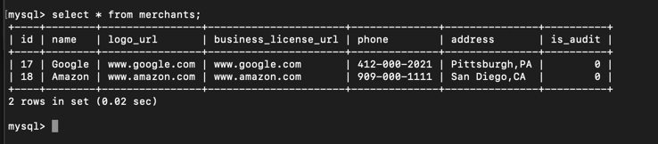

# CardCoupon Merchants side Application
This is the subsystem for Merchant side.
You can run the application

# Requirements
For building and running the application you need:

<a href="https://www.oracle.com/java/technologies/javase/javase-jdk8-downloads.html">JDK 1.8</a>
<a href="https://maven.apache.org/">Maven</a>

# Running the project
There are several ways to run a Spring Boot application on your local machine. 
One way is to execute the main method in 
*the src/main/java/com/cardcoupon/passbook/MerchantsApplication.java* 
class from your IDE.

```
mvn clean install
```

## start sql:
```
mysql.server start
```

## start Kafka:
```
bin/zookeeper-server-start.sh config/zookeeper.properties
bin/kafka-server-start.sh config/server.properties
```

## create topic
```
bin/kafka-topics.sh --create --topic merchants-template --bootstrap-server localhost:9092
```

## see topic describe
```
bin/kafka-topics.sh --describe --topic merchants-template --bootstrap-server localhost:9092
```

## start consumer console
```
bin/kafka-console-consumer.sh --bootstrap-server localhost:9092 --topic merchants-template --from-beginning
```

## url request
1. get merchants from database
```
http://localhost:9527/merchants/{id}
```
#### example:


2. create merchants
### get merchants from database
```
http://localhost:9527/merchants/create
```
#### example:
```
{
    "name": "Amazon",
    "logoUrl": "www.amazon.com",
    "businessLicenseUrl": "www.amazon.com",
    "phone": "909-000-1111",
    "address": "San Diego,CA"
}
```


there should be new records in mysql database.


3. drop template
### get merchants from database
```
http://localhost:9527/merchants/create
```
#### example:
```
{
    "background":3,
    "desc":"this is a coupoun for vitamins",
    "end":1626665870000,
    "hasToken":false,
    "id":11,
    "limit":10000,
    "start":1623209872000,
    "summary":"Summary: vitamin coupoun for CVS",
    "title":"CVS Vitamin 2021"
}
```
there shoule be new templates in KAFKA

